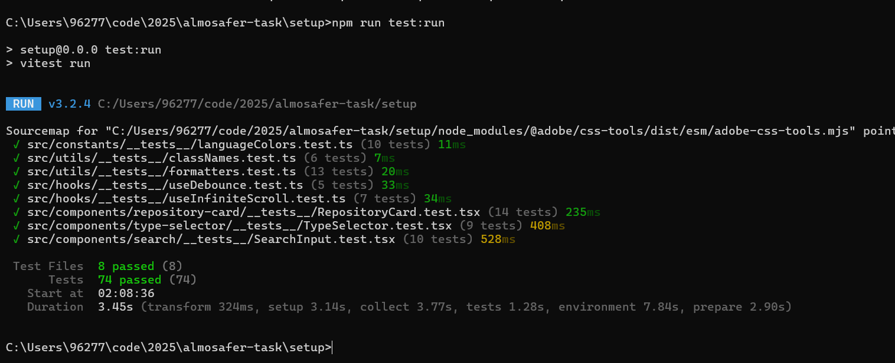
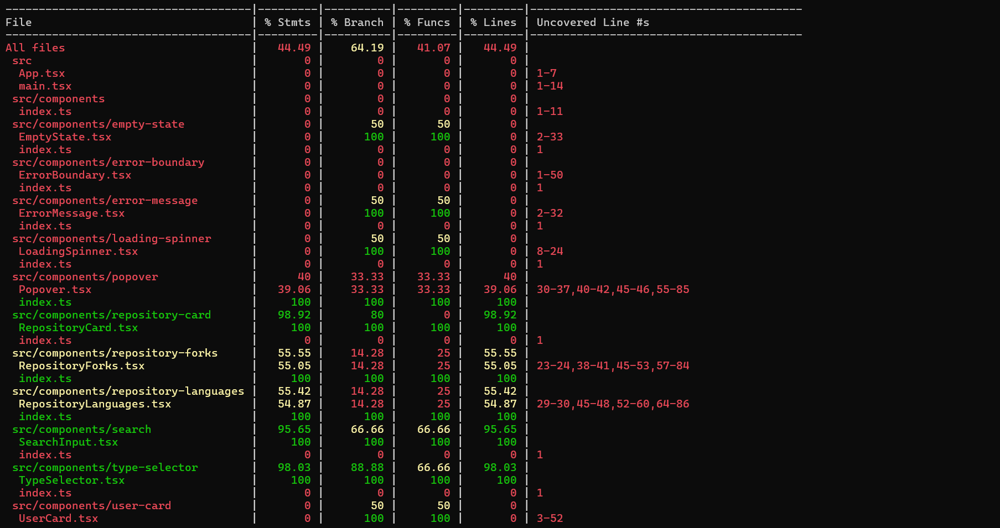

# GitHub Search App

A modern, responsive Single Page Application (SPA) built with React, TypeScript, and Vite that allows users to search for GitHub repositories and users using the GitHub Search API.

## Features

- **Dual Search Types**: Search for both GitHub users and repositories
- **Real-time Search**: Debounced search input with 500ms delay for optimal performance
- **Infinite Scroll**: infinite scroll implemented
- **User Cards**: 
  - User avatars and profile information
- **State Management**: Redux Toolkit Query (RTK Query) for efficient API state management
- **Error Handling**: Comprehensive error states and loading indicators
- **Responsive Design**: Mobile-first design with Tailwind CSS
- **TypeScript**: Full type safety throughout the application
- **Unit Testing**: Comprehensive test coverage with Vitest and React Testing Library

## Tech Stack

- **Frontend**: React 18, TypeScript
- **Build Tool**: Vite
- **Styling**: Tailwind CSS
- **State Management**: Redux Toolkit Query (RTK Query)
- **HTTP Client**: Axios
- **Icons**: Heroicons
- **Testing**: Vitest, React Testing Library
- **Linting**: ESLint

## Prerequisites

- Node.js (version 18 or higher recommended)
- npm or yarn

## Installation

1. Clone the repository:
```bash
git clone <repository-url>
```

2. Install dependencies:
```bash
npm install
```

3. Start the development server:
```bash
npm run dev
```

4. Open your browser and navigate to `http://localhost:3000`


### Running Tests
I made unit tests using vitest for the main points required, you can find down below pictures for the result of running the test and their coverage


```bash
# Run tests in watch mode during development
npm run test

# Run tests once
npm run test:run


# Generate coverage report
npm run test:coverage
```

### Test Results



### Test Coverage



## Performance Optimizations

1. **Debounced Search**: Prevents excessive API calls (500ms delay)
2. **RTK Query Caching**: Reduces redundant API requests with 5-minute cache for language and fork data
3. **Infinite Scroll**: Loads content progressively as user scrolls
4. **Lazy Loading**: API calls for languages and forks only when user clicks "see more"
5. **Image Error Handling**: Graceful fallbacks for broken avatars
6. **Efficient State Management**: Redux Toolkit with RTK Query for minimal boilerplate

